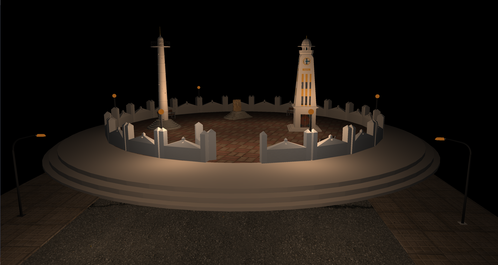

# 3D Modeling and Rendering of Dharahara using OpenGl

## Introduction

This is a Computer Graphics project done in the fifth semester of computer Engineering by:

- Sandeep Acharya
- Saujan Tiwari
- Sangam Chaulagain

## Libraries Used

- GLFW
- Glad
- Assimp

## Output

### Day View

### Night View

## How to run

This project is build using visual studio 2019.

1. Open Visual Studio 2019.
2. Click on run to run the project.

Use A, S, W, D to move around.\
Press Z for day view and X for night view.

In case of linking errors, You probably need to build the libraries yourself.\
You can use cmake to buid the libraries.

### Helpful links

Visual Studio 2019: https://visualstudio.microsoft.com/downloads/ \
Setting up Libraries: https://learnopengl.com/Getting-started/Creating-a-window \
Learn Opengl: https://learnopengl.com/
